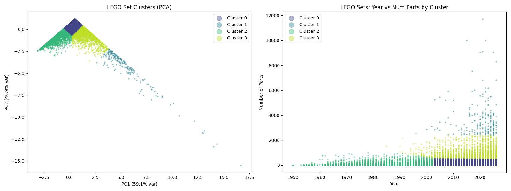
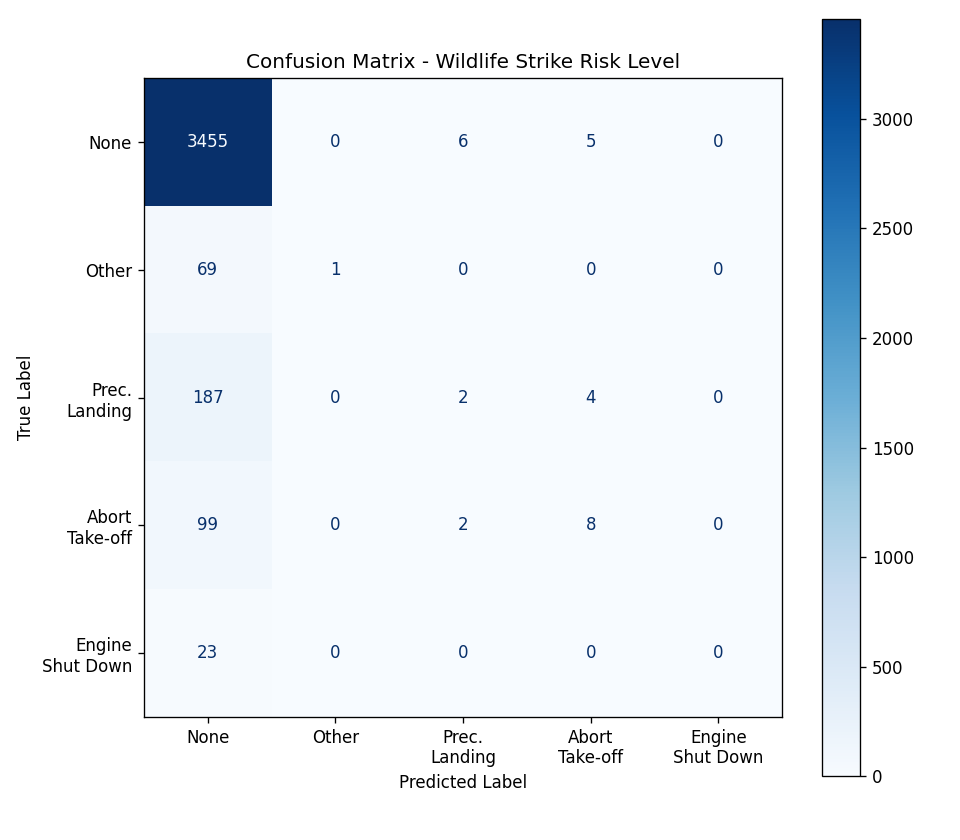
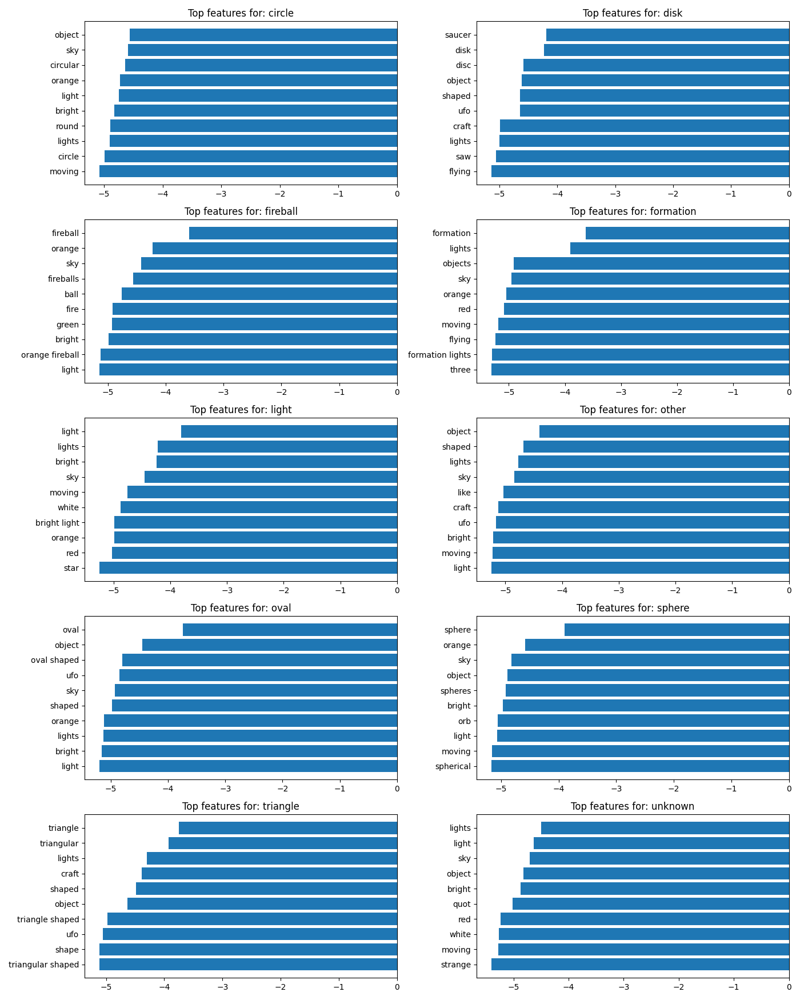

<div align="center">

# 🏆 ML-Triathlon

**Three Algorithms · Three Datasets · One Challenge**

[](https://python.org)
[](https://scikit-learn.org)
[](https://jupyter.org)
[](https://github.com/mtahanaeem/ML-Triathlon)

</div>

---

## 📋 Overview

This project implements and evaluates **three different machine learning algorithms** on **three distinct real-world datasets**. Each algorithm was carefully chosen to match the characteristics of its respective dataset and problem type.

| Algorithm | Dataset | Problem Type | Objective |
|:---------:|:-------:|:------------:|:----------|
| **K-Means** 🧩 | LEGO Database | Unsupervised Clustering | Group LEGO sets by complexity & era |
| **KNN** 📡 | Aviation Wildlife Strikes | Supervised Classification | Classify strike risk level |
| **Naive Bayes** 👽 | UFO Sightings Reports | Text Classification | Predict UFO shape from descriptions |

---

## 🗂️ Repository Structure

```
ML-Triathlon/
├── 📓 K-Means_LEGO.ipynb              # K-Means clustering notebook
├── 📓 KNN_Wildlife_Strikes.ipynb      # KNN classification notebook
├── 📓 Naive_Bayes_UFO.ipynb           # Naive Bayes text classification notebook
├── 📁 datasets/
│   ├── lego_sets.csv                   # 27K LEGO sets
│   ├── lego_themes.csv                 # 494 LEGO themes
│   ├── wildlife_strikes.csv            # 19K FAA wildlife strike records
│   └── nuforc_sightings.csv            # 80K UFO sighting reports
├── 📁 results/
│   ├── lego_elbow.png                  # Elbow & silhouette plots
│   ├── lego_clusters.png               # Cluster visualizations
│   ├── wildlife_knn_accuracy.png       # Accuracy vs k curve
│   ├── wildlife_confusion_matrix.png   # Confusion matrix
│   ├── ufo_confusion_matrix.png        # Confusion matrix
│   └── ufo_top_features.png            # Top TF-IDF features
├── .gitignore
└── README.md                           # You are here
```

---

## 📊 Datasets

### 🧩 LEGO Database
> **Source:** [Rebrickable](https://rebrickable.com/) · **27,000+** sets

Contains every official LEGO set with release year, piece count, theme, and images. Perfect for clustering — reveals how LEGO has evolved from simple blocks to complex collector sets spanning nearly a century.

### ✈️ Aviation Wildlife Strikes
> **Source:** [FAA Wildlife Strike Database](https://www.faa.gov/airports/airport_safety/wildlife/) · **19,000+** records

Self-reported wildlife strike incidents between 1990-1997. Includes aircraft type, species struck, phase of flight, weather conditions, and resulting damage. A classic imbalanced classification problem.

### 👽 UFO Sightings Reports
> **Source:** [NUFORC](https://nuforc.org/) · **80,000+** reports

The National UFO Reporting Center's collection of sighting reports spanning decades. Each report includes a timestamp, location, witness description, and reported shape — making it a fun text classification challenge.

---

## 🧠 Algorithms & Results

### 1️⃣ K-Means Clustering — LEGO Database

| Metric | Value |
|:-------|:-----:|
| Algorithm | K-Means (Euclidean distance) |
| Features | `year`, `num_parts` |
| Optimal k | **4** |
| Silhouette Score | **0.5202** |

**Discovered Clusters:**

| Cluster | Size | Description |
|:--------|:----:|:------------|
| 🟣 Cluster 0 | 12,104 | Modern small sets — polybags, books, accessories |
| 🟡 Cluster 1 | 201 | Large collector sets — 2000+ pieces, premium builds |
| 🔵 Cluster 2 | 5,677 | Vintage classics — 1950s-1980s, low part counts |
| 🟢 Cluster 3 | 1,830 | Mid-size modern — 500-1500 pieces, retail sets |

> **Insight:** LEGO sets naturally separate into era-based complexity groups. The vintage cluster and large collector sets are the most distinct — a clear separation between "classic LEGO" and today's elaborate builds.

---

### 2️⃣ K-Nearest Neighbors — Aviation Wildlife Strikes

| Metric | Value |
|:-------|:-----:|
| Algorithm | KNN Classification |
| Features | 8 (height, speed, aircraft mass, engines, phase of flight, time of day, sky, species) |
| Best k | **8** |
| Test Accuracy | **89.77%** |
| 5-Fold CV Accuracy | **89.57%** |

**Class Distribution:**

| Risk Level | Count | Percentage |
|:-----------|:-----:|:----------:|
| ✅ None | 17,329 | 89.8% |
| ⚠️ Precautionary Landing | 965 | 5.0% |
| 🔶 Aborted Take-off | 544 | 2.8% |
| 🔷 Other | 348 | 1.8% |
| 🔴 Engine Shut Down | 116 | 0.6% |

> **Insight:** High accuracy but severely imbalanced. The model perfectly identifies non-damaging strikes (recall = 1.00) but struggles with rare high-severity events. Future work should address this with SMOTE or class-weighted approaches.

---

### 3️⃣ Naive Bayes — UFO Sightings Reports

| Metric | Value |
|:-------|:-----:|
| Algorithm | Multinomial Naive Bayes + TF-IDF |
| Text Features | 5,000 unigrams & bigrams |
| Classes | 10 shape categories |
| Test Accuracy | **46.10%** |
| Baseline (majority) | 24.3% |

**Best Predicted Shapes:**

| Shape | F1-Score | Signal Words |
|:------|:--------:|:-------------|
| 🔺 Triangle | **0.61** | "silent", "triangular", "black" |
| 🔥 Fireball | **0.57** | "orange", "streak", "explosion" |
| 💡 Light | **0.56** | "bright", "hovering", "flashing" |
| 🥏 Disk | **0.48** | "saucer", "metallic", "craft" |
| ⚪ Sphere | **0.45** | "orb", "glowing", "ball" |

> **Insight:** Witness descriptions contain meaningful signal — nearly doubling the baseline accuracy. Triangle and fireball are most distinctive, while circle vs sphere and other vs unknown are commonly confused pairs.

---

## 🚀 Getting Started

### Prerequisites

Make sure you have the required libraries installed:

```bash
pip install numpy pandas scikit-learn matplotlib nltk seaborn nbformat
```

### Running the Notebooks

Open any of the three notebooks in VS Code or Jupyter and run cells sequentially:

```bash
code K-Means_LEGO.ipynb
```

All plots render inline inside the notebook, and are also saved to the `results/` folder.

---

## 🖼️ Results Preview

### K-Means — LEGO Clusters


### KNN — Confusion Matrix


### Naive Bayes — Top Features per Shape


---

## 📈 Key Takeaways

1. **🎯 Match the algorithm to the data** — Unsupervised clustering for discovering hidden groups, KNN for feature-based classification, Naive Bayes for text. Each has its sweet spot.

2. **⚖️ Imbalanced data is everywhere** — 90% of wildlife strikes cause no damage. Accuracy is misleading; always check per-class precision, recall, and F1.

3. **📝 Text has signal, even from noisy sources** — UFO sighting descriptions vary wildly, but Naive Bayes still extracts meaningful patterns (46% vs 24% baseline).

4. **🔍 Visualization tells the story** — Elbow plots, silhouette scores, confusion matrices, and word clouds make results interpretable.

---

## 🛠️ Tech Stack

| Technology | Purpose |
|:-----------|:--------|
| [Python](https://python.org) | Core language |
| [scikit-learn](https://scikit-learn.org) | ML algorithms (K-Means, KNN, Naive Bayes) |
| [Pandas](https://pandas.pydata.org) | Data manipulation |
| [NumPy](https://numpy.org) | Numerical computing |
| [Matplotlib](https://matplotlib.org) | Visualization |
| [NLTK](https://nltk.org) | Text preprocessing (stopwords) |
| [Jupyter](https://jupyter.org) | Interactive notebooks |

---

## 🤝 Connect

<div align="center">

[](https://github.com/mtahanaeem)
[](https://linkedin.com/in/mtahanaeem)

**If you found this project interesting, consider giving it a ⭐!**

</div>
